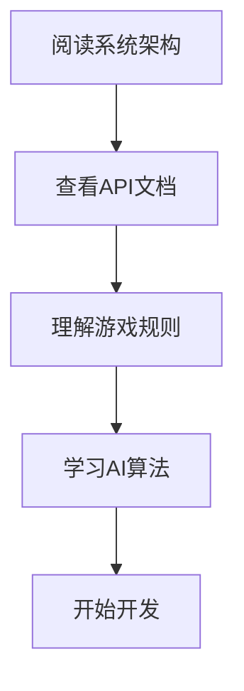
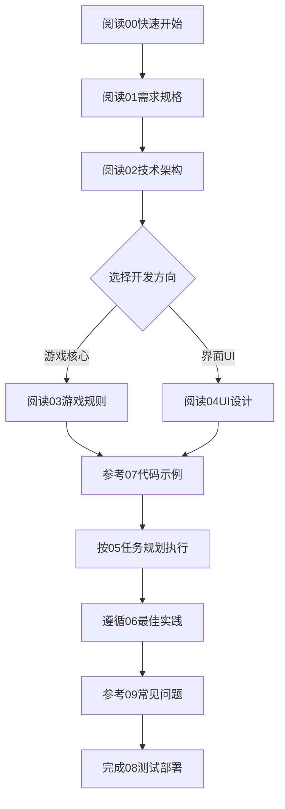

# H5 五子棋项目开发文档

> **版本**: v2.0.0  
> **文档类型**: AI 开发文档  
> **最后更新**: 2025年1月  
> **适用对象**: AI 编程助手、Vibe Coding

---

## 📌 项目概述

H5五子棋是一款基于模块化API设计的纯前端五子棋游戏，支持双人对战、人机对战、机机对战和VCF练习模式。项目采用原生JavaScript ES6+开发，所有模块均提供同步和异步API接口，便于集成和扩展。

### 核心特性

- ✅ 完整的五子棋规则实现（包含禁手规则）
- ✅ 4级AI难度系统（新手/正常/困难/地狱）
- ✅ 4种游戏模式（PvP/PvE/EvE/VCF练习）
- ✅ 模块化API设计，支持同步/异步调用
- ✅ 完整的事件系统和状态管理
- ✅ 棋局保存、加载与回放功能
- ✅ VCF冲四练习系统
- ✅ 完全离线运行，无需服务器

---

## 📚 文档导航

### 核心文档（按阅读顺序）

#### 1. [系统架构设计](./ARCHITECTURE.md) ⭐️ 必读
**内容**: 模块化架构、API设计理念、模块间通信、依赖关系
- 模块化设计原则
- API模块化实现
- 同步/异步接口规范
- 事件驱动架构
- 依赖注入和模块加载

#### 2. [API参考文档](./API_REFERENCE.md) ⭐️ 必读
**内容**: 完整的API接口文档，包含所有模块的公共接口
- GomokuGame API
- BoardRenderer API  
- AI API
- SaveLoad API
- Replay API
- VCF Practice API
- Utils API

#### 3. [游戏规则详解](./GAME_RULES.md)
**内容**: 五子棋规则、禁手检测算法、胜负判定
- 基本规则
- 禁手规则（三三/四四/长连）
- 胜负判定算法
- VCF规则

#### 4. [AI算法详解](./AI_ALGORITHMS.md)
**内容**: AI决策算法、评估函数、VCF搜索
- AI难度分级
- Minimax + Alpha-Beta剪枝
- VCF搜索算法
- 威胁空间搜索
- 评估函数设计

#### 5. [数据结构规范](./DATA_STRUCTURES.md)
**内容**: 所有数据格式定义、接口规范
- 棋盘数据结构
- 游戏状态数据
- 存档数据格式
- VCF题目数据
- 事件数据格式

#### 6. [开发指南](./DEVELOPMENT_GUIDE.md)
**内容**: 开发流程、最佳实践、代码规范
- 快速开始
- 开发环境设置
- 编码规范
- 模块开发指南
- 调试技巧

#### 7. [UI组件规范](./UI_COMPONENTS.md)
**内容**: 界面设计、组件规范、交互流程
- 设计语言
- 组件目录
- 交互规范
- 响应式设计

#### 8. [测试与部署](./TESTING_DEPLOYMENT.md)
**内容**: 测试策略、部署流程
- 功能测试
- 性能测试
- 部署指南
- 持续集成

#### 9. [常见问题FAQ](./FAQ.md)
**内容**: 常见问题与解决方案
- 模块加载问题
- 性能优化
- 兼容性问题
- 调试技巧

#### 10. [开发任务清单](./TASK_CHECKLIST.md)
**内容**: 按阶段划分的开发任务
- 阶段划分
- 任务清单
- 验收标准
- 时间估算

---

## 🚀 快速开始

### 3分钟快速理解项目



### 推荐阅读路径

**对于首次开发**:
1. [ARCHITECTURE.md](./ARCHITECTURE.md) - 理解模块化设计（30分钟）
2. [API_REFERENCE.md](./API_REFERENCE.md) - 熟悉API接口（45分钟）
3. [GAME_RULES.md](./GAME_RULES.md) - 掌握游戏规则（30分钟）
4. [DEVELOPMENT_GUIDE.md](./DEVELOPMENT_GUIDE.md) - 开始编码（持续）

**对于功能开发**:
1. 查阅 [API_REFERENCE.md](./API_REFERENCE.md) 确定接口
2. 参考 [DATA_STRUCTURES.md](./DATA_STRUCTURES.md) 定义数据格式
3. 遵循 [DEVELOPMENT_GUIDE.md](./DEVELOPMENT_GUIDE.md) 编码规范
4. 使用 [TASK_CHECKLIST.md](./TASK_CHECKLIST.md) 追踪进度

**遇到问题时**:
1. 查阅 [FAQ.md](./FAQ.md)
2. 检查 [API_REFERENCE.md](./API_REFERENCE.md) 接口用法
3. 参考 [DEVELOPMENT_GUIDE.md](./DEVELOPMENT_GUIDE.md) 调试章节

---

## 🎯 项目技术栈

```
技术栈
├── 语言: JavaScript ES6+
├── 渲染: HTML5 Canvas 2D API
├── 样式: CSS3 (变量 + Grid + Flexbox)
├── 存储: LocalStorage
├── 模块化: ES6 Modules + window全局导出
├── 架构: 事件驱动 + API模块化
└── 部署: 静态文件托管
```

### 浏览器支持
- Chrome 60+ ✅
- Firefox 55+ ✅
- Safari 12+ ✅
- Edge 79+ ✅
- IE 11 ❌

### 🌐 部署渠道
- **Vercel**（推荐）: 零配置静态托管，支持自动HTTPS与CDN。根目录已提供 `vercel.json` 配置，详见 [TESTING_DEPLOYMENT.md](./TESTING_DEPLOYMENT.md#部署方案)。
- **GitHub Pages**: 适合长期托管，可配合自定义域名。
- **本地HTTP服务器**: 用于开发调试（`python3 -m http.server 8080`）。

---

## 📦 项目结构

```
gomoku-game/
├── index.html              # 主页面
├── js/                     # JavaScript模块
│   ├── utils.js           # 工具函数库
│   ├── game-core.js       # 游戏核心引擎 (API模块)
│   ├── board-renderer.js  # 棋盘渲染器 (API模块)
│   ├── ai-advanced.js     # 高级AI算法 (API模块)
│   ├── game-save-load.js  # 存档管理 (API模块)
│   ├── game-replay.js     # 回放功能 (API模块)
│   ├── vcf-practice.js    # VCF练习管理 (API模块)
│   └── demo.js            # 界面交互控制
├── css/                    # 样式文件
│   ├── style.css          # 主样式
│   └── animations.css     # 动画效果
└── doc/                    # 开发文档（当前目录）
    ├── README.md          # 本文档
    ├── ARCHITECTURE.md    # 架构设计
    ├── API_REFERENCE.md   # API参考
    └── ...                # 其他文档
```

---

## 🔑 核心概念

### API模块化设计

所有核心模块都遵循统一的API设计原则：

```javascript
// 1. 同步API - 立即返回结果
const result = game.placePiece(7, 7);
if (result.success) {
  console.log('落子成功');
}

// 2. 异步API - 返回Promise
const move = await ai.getAIMoveAsync('HELL');
game.placePiece(move.x, move.y);

// 3. 事件API - 发布订阅模式
game.on('piecePlace', (event) => {
  console.log('落子事件:', event);
});

// 4. 链式调用
game.reset()
    .setMode('PvE')
    .setDifficulty('HARD')
    .start();
```

### 模块间通信

- **直接调用**: 模块间通过公共API直接调用
- **事件驱动**: 使用事件系统解耦模块
- **状态管理**: 统一的状态管理机制
- **依赖注入**: 通过构造函数注入依赖

详见：[ARCHITECTURE.md](./ARCHITECTURE.md#模块间通信)

---

## 🎨 主要特性

### 1. 模块化API设计
- 每个模块都是独立的API单元
- 支持同步和异步调用
- 完整的类型定义和错误处理
- 统一的返回值格式

### 2. 事件驱动架构
- 完整的事件系统
- 支持事件监听和触发
- 异步事件处理
- 事件传播和取消

### 3. 状态管理
- 单一数据源
- 不可变数据流
- 状态快照和回滚
- 状态持久化

### 4. 错误处理
- 统一的错误格式
- 错误码系统
- 错误恢复机制
- 调试友好

---

## 📊 文档使用约定

### 代码标识
- `✅ 推荐`: 最佳实践
- `❌ 避免`: 不推荐的做法
- `⚠️ 注意`: 需要特别关注
- `💡 提示`: 优化建议
- `🔧 配置`: 配置项说明

### 优先级标识
- **P0**: 核心功能，必须实现
- **P1**: 重要功能，强烈建议
- **P2**: 增强功能，可选
- **P3**: 未来功能，暂缓

### API状态标识
- `[Stable]`: 稳定API，不会变更
- `[Beta]`: 测试API，可能变更
- `[Deprecated]`: 已弃用，将被移除
- `[Async]`: 异步API
- `[Sync]`: 同步API

---

## 🤝 开发流程

```
1. 阅读架构文档 → 理解模块化设计
2. 查阅API文档 → 确定接口规范
3. 参考数据结构 → 定义数据格式
4. 遵循开发指南 → 编写模块代码
5. 编写单元测试 → 验证功能正确
6. 集成测试 → 确保模块协作
7. 性能优化 → 提升响应速度
8. 文档更新 → 同步API变更
```

---

## 📖 附录

### 旧版文档参考

如需参考原始文档，可查看以下文件（保留供参考）：
- `00_快速开始指南.md` - 快速上手指南
- `01_项目需求规格说明书.md` - 需求规格
- `02_技术架构设计文档.md` - 旧架构文档
- `03_游戏规则与AI算法要点.md` - 规则和算法
- `04_UI设计与交互规范.md` - UI设计规范
- `05_重新开发任务规划清单.md` - 任务规划
- `06_开发建议与最佳实践.md` - 最佳实践
- `07_核心代码示例与模板.md` - 代码示例
- `08_测试与部署指南.md` - 测试部署
- `09_常见问题与解决方案.md` - FAQ
- `10_完整实现细节补充.md` - 实现细节
- `迁移文档使用指南.md` - 使用指南
- `迁移文档验收报告.md` - 验收报告

---

## ✨ 为什么选择这个文档结构？

1. **模块化优先**: 强调API模块化设计，便于集成和扩展
2. **AI友好**: 结构清晰，便于AI理解和生成代码
3. **无歧义**: 明确的规范，避免理解偏差
4. **可追溯**: 完整的接口定义和数据格式
5. **易维护**: 模块独立，修改影响小
6. **支持异步**: 现代化的异步编程支持

---

## 📝 版本历史

- **v2.0.0** (2025-01): 重构文档结构，强化API模块化设计
- **v1.2.0** (2025-01): 添加VCF练习功能
- **v1.1.0**: 完善AI算法
- **v1.0.0**: 初始版本

---

**文档维护**: 本文档随项目持续更新  
**问题反馈**: 通过项目Issue提交文档问题  
**贡献指南**: 欢迎改进建议和PR

---

> 💡 **开始开发**: 建议从 [ARCHITECTURE.md](./ARCHITECTURE.md) 开始，理解整体架构后再查阅具体API文档。

---

## 原始迁移文档（完整保留）

# H5五子棋项目 - 迁移文档中心

> **版本**: v1.2.0  
> **创建日期**: 2025年1月  
> **文档用途**: 用于AI辅助开发，完整复刻H5五子棋项目

---

## 📋 项目概述

H5五子棋是一款基于HTML5 Canvas技术开发的在线五子棋游戏，支持双人对战、人机对战、机机对战和VCF练习模式。项目采用纯JavaScript ES6+开发，无构建工具，所有模块通过浏览器window全局对象导出。

### 核心特性
- ✅ 完整的五子棋规则实现（包含禁手规则）
- ✅ 4级AI难度系统（新手/正常/困难/地狱）
- ✅ 4种游戏模式（PvP/PvE/EvE/VCF练习）
- ✅ 棋局保存、加载与回放功能
- ✅ VCF冲四练习系统
- ✅ 完全离线运行，无需服务器

---

## 📚 文档导航

### 核心文档（按阅读顺序）

#### 1. [快速开始指南](./00_快速开始指南.md)
**适合**: 首次接触项目的AI开发者  
**内容**: 
- 5分钟快速上手
- 本地运行步骤
- 项目结构概览
- 核心文件说明

#### 2. [项目需求规格说明书](./01_项目需求规格说明书.md)
**适合**: 理解项目目标和功能范围  
**内容**:
- 完整功能需求
- 用户界面需求
- 性能与兼容性需求
- 验收标准

#### 3. [技术架构设计文档](./02_技术架构设计文档.md)
**适合**: 理解系统架构和模块关系  
**内容**:
- 技术栈选型
- 模块化架构设计
- 数据流和状态管理
- 模块导出机制

#### 4. [游戏规则与AI算法要点](./03_游戏规则与AI算法要点.md)
**适合**: 实现核心游戏逻辑和AI  
**内容**:
- 五子棋规则详解
- 禁手检测算法
- AI难度等级设计
- Minimax算法实现

#### 5. [UI设计与交互规范](./04_UI设计与交互规范.md)
**适合**: 实现界面和用户交互  
**内容**:
- 界面布局设计
- 木质棋盘风格
- 交互流程规范
- 响应式设计

#### 6. [重新开发任务规划清单](./05_重新开发任务规划清单.md)
**适合**: 按步骤执行开发任务  
**内容**:
- 分阶段开发计划
- 任务优先级
- 里程碑定义
- 质量检查清单

#### 7. [开发建议与最佳实践](./06_开发建议与最佳实践.md)
**适合**: 编写高质量代码  
**内容**:
- 编码规范
- 命名约定
- 错误处理模式
- 性能优化建议

### 补充文档

#### 8. [核心代码示例与模板](./07_核心代码示例与模板.md)
**适合**: 快速实现关键功能  
**内容**:
- 模块导出模板
- 禁手检测示例
- AI搜索代码
- Canvas渲染示例

#### 9. [测试与部署指南](./08_测试与部署指南.md)
**适合**: 项目上线前的准备  
**内容**:
- 测试策略
- 部署步骤
- 性能验证
- 浏览器兼容性

#### 10. [常见问题与解决方案](./09_常见问题与解决方案.md)
**适合**: 解决开发中的疑难问题  
**内容**:
- 模块加载问题
- 禁手判定疑问
- 性能优化方案
- 已知Bug修复

#### 11. [完整实现细节补充](./10_完整实现细节补充.md)
**适合**: 查阅具体实现细节  
**内容**:
- 完整HTML结构（所有模态框）
- CSS动画完整列表
- 数据格式详细定义
- 风险提示系统实现
- 回放系统完整逻辑
- 事件流程图
- LocalStorage管理
- 响应式断点CSS

#### 12. [迁移文档使用指南](./迁移文档使用指南.md)
**适合**: 快速上手整套文档  
**内容**:
- 阅读路径建议
- 场景化索引
- 阶段性检查清单
- 注意事项与技巧
- 完成标准

---

## 🎯 快速索引

### 按功能模块查找

| 模块 | 相关文档章节 |
|------|------------|
| **棋盘渲染** | 02-技术架构(渲染层), 04-UI设计, 07-代码示例 |
| **游戏规则** | 03-游戏规则, 07-代码示例(禁手检测) |
| **AI系统** | 03-AI算法要点, 07-代码示例(AI搜索) |
| **存档回放** | 02-技术架构(辅助层), 05-任务规划(阶段3) |
| **VCF练习** | 03-游戏规则(VCF), 05-任务规划(扩展功能) |
| **界面交互** | 04-UI设计, 06-最佳实践(用户体验) |

### 按开发阶段查找

| 阶段 | 推荐阅读 |
|------|---------|
| **启动阶段** | 00-快速开始, 01-需求规格, 02-技术架构 |
| **核心开发** | 03-游戏规则, 07-代码示例, 06-最佳实践 |
| **UI实现** | 04-UI设计, 06-最佳实践(界面规范) |
| **功能完善** | 05-任务规划(阶段2-3), 09-常见问题 |
| **上线准备** | 08-测试部署, 05-任务规划(验收清单) |

---

## 🚀 推荐使用流程

### 对于AI开发助手



### 三步快速启动

1. **理解项目** (30分钟)
   - 阅读 00-快速开始指南
   - 浏览 01-需求规格说明书
   - 快速过一遍 02-技术架构设计

2. **准备开发** (1小时)
   - 精读 03-游戏规则与AI算法
   - 精读 04-UI设计与交互规范
   - 查看 07-核心代码示例

3. **开始编码** (持续)
   - 按照 05-任务规划清单逐步实现
   - 遵循 06-开发建议与最佳实践
   - 遇到问题查阅 09-常见问题与解决方案

---

## 📝 文档使用约定

### 代码块标识
- `✅ 推荐写法`: 正确的实现方式
- `❌ 错误写法`: 应该避免的做法
- `⚠️ 注意事项`: 需要特别关注的点
- `💡 提示`: 优化建议或技巧

### 优先级标识
- **P0**: 必须实现，核心功能
- **P1**: 重要功能，显著影响用户体验
- **P2**: 增强功能，锦上添花
- **P3**: 未来功能，可以延后

### 文档版本
- **v1.0**: 初始版本，涵盖核心功能
- **v1.2**: 当前版本，包含VCF练习功能

---

## 🎨 项目技术栈概览

```
技术栈组成
├── 前端框架: 无 (纯JavaScript)
├── 语言: JavaScript ES6+
├── 渲染: HTML5 Canvas 2D API
├── 样式: CSS3 (变量 + Grid + Flexbox)
├── 存储: LocalStorage
├── 模块化: 全局window导出
└── 部署: 静态文件托管 (GitHub Pages)
```

### 浏览器支持
- Chrome 60+ ✅
- Firefox 55+ ✅
- Safari 12+ ✅
- Edge 79+ ✅
- IE 11 ❌ (不支持)

---

## 📦 项目文件结构

```
gomoku-game/
├── index.html              # 主页面
├── js/                     # JavaScript模块
│   ├── game-core.js       # 游戏核心引擎 (2145行)
│   ├── board-renderer.js  # 棋盘渲染器 (723行)
│   ├── demo.js            # 界面交互控制 (1775行)
│   ├── utils.js           # 工具函数库 (302行)
│   ├── game-save-load.js  # 存档管理 (626行)
│   ├── game-replay.js     # 回放功能 (500+行)
│   ├── vcf-practice.js    # VCF练习管理 (312行)
│   └── ai-advanced.js     # 高级AI算法 (692行)
├── css/                    # 样式文件
│   ├── style.css          # 主样式 (1281行)
│   └── animations.css     # 动画效果
└── doc_move/              # 迁移文档 (当前目录)
    ├── README.md
    ├── 00_快速开始指南.md
    ├── 01_项目需求规格说明书.md
    ├── 02_技术架构设计文档.md
    ├── 03_游戏规则与AI算法要点.md
    ├── 04_UI设计与交互规范.md
    ├── 05_重新开发任务规划清单.md
    ├── 06_开发建议与最佳实践.md
    ├── 07_核心代码示例与模板.md
    ├── 08_测试与部署指南.md
    └── 09_常见问题与解决方案.md
```

---

## ⚡ 关键技术决策

### 1. 为什么不使用构建工具？
- **原因**: 保持项目简单，易于理解和部署
- **优势**: 零配置，直接在浏览器运行，快速迭代
- **劣势**: 无法使用npm包，需要手动管理依赖

### 2. 为什么使用window全局导出？
- **原因**: 浏览器原生支持，无需模块加载器
- **实现**: 每个模块通过 `window.ModuleName = ModuleName` 导出
- **注意**: 必须严格控制加载顺序 (见 index.html)

### 3. 为什么选择Canvas而不是DOM？
- **性能**: Canvas适合频繁重绘的棋盘
- **效果**: 更容易实现棋子光泽、阴影等效果
- **灵活性**: 完全控制渲染过程

---

## 🔍 核心概念速查

| 概念 | 说明 | 详细文档 |
|------|------|---------|
| **禁手** | 黑棋的三三、四四、长连禁手规则 | 03-游戏规则 §2 |
| **活三** | 两端都能成活四的三子连线 | 03-游戏规则 §2.1 |
| **VCF** | 连续冲四战术，强制获胜序列 | 03-游戏规则 §4.3 |
| **Minimax** | AI决策的基础算法 | 03-AI算法 §3.1 |
| **Alpha-Beta** | Minimax的优化剪枝算法 | 03-AI算法 §3.2 |
| **威胁空间搜索** | 地狱级AI使用的高级搜索 | 03-AI算法 §4.2 |

---

## 📊 项目数据统计

- **总代码行数**: ~8000行
- **核心模块**: 8个
- **支持的游戏模式**: 4种
- **AI难度等级**: 4级
- **VCF练习题**: 40+道
- **文档页数**: 10个迁移文档

---

## 🤝 如何使用这些文档

### 对于AI编程助手
1. **完整理解**: 依次阅读00-06号文档
2. **快速实现**: 重点查看07-核心代码示例
3. **质量保证**: 参考06-最佳实践和08-测试部署
4. **问题解决**: 查阅09-常见问题

### 对于人类开发者
1. 从README(本文件)开始，了解整体结构
2. 根据开发阶段选择对应文档阅读
3. 代码实现时参考07-代码示例
4. 保持与06-最佳实践的一致性

---

## ✅ 文档完整性检查

- [x] 00 - 快速开始指南
- [x] 01 - 项目需求规格说明书
- [x] 02 - 技术架构设计文档
- [x] 03 - 游戏规则与AI算法要点
- [x] 04 - UI设计与交互规范
- [x] 05 - 重新开发任务规划清单
- [x] 06 - 开发建议与最佳实践
- [x] 07 - 核心代码示例与模板
- [x] 08 - 测试与部署指南
- [x] 09 - 常见问题与解决方案
- [x] 10 - 完整实现细节补充

---

## 🎓 额外学习资源

### 五子棋知识
- 五子棋禁手规则详解
- VCF战术理论
- 经典开局定式

### 算法知识
- Minimax算法原理
- Alpha-Beta剪枝优化
- 威胁空间搜索 (Victor Allis理论)

### 前端技术
- Canvas 2D API参考
- ES6+ JavaScript特性
- CSS Grid / Flexbox布局

---

**文档维护**: 本文档集由开发团队维护，确保与代码实现保持同步  
**版本日期**: 2025年1月  
**联系方式**: 通过GitHub Issues反馈文档问题

---

> 💡 **提示**: 建议按顺序阅读文档，每个文档都建立在前一个文档的基础上。如果是第一次接触项目，请从 [00_快速开始指南.md](./00_快速开始指南.md) 开始。
